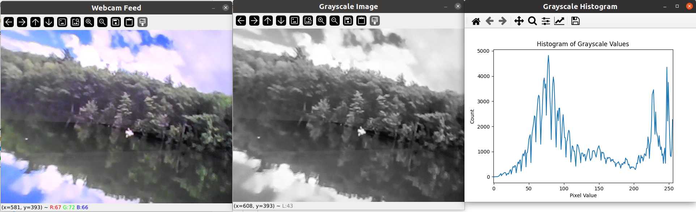

# Camera Image Processing

A small application that captures an image from your webcam, converts it to 8-bit grayscale, and generates a grayscale histogram.

As a stretch, a GUI app is also provided (`gui_main.py`), which does the following:
- Displays four live views of the camera feed in a 2x2 grid: Original, Grayscale, Blurred, and Edge-Detected.
- Provides real-time adjustable sliders for the blur kernel size and the edge detection thresholds.
- Displays a live histogram exclusively for the Grayscale view.

## Sample Outputs

### main.py
After capturing an image from the webcam, you should see:
1. A **grayscale image** window
2. A **maplotlib histogram** windows showing grayscale pixel distribution



### gui_main.py

When running the GUI app, you’ll see:

1. **Original** feed (top-left).
2. **Grayscale** feed (top-right) along with a live histogram (below the images).
3. **Blurred** feed (bottom-left), with a slider to adjust kernel size.
4. **Edge Detection** feed (bottom-right), with sliders for min/max threshold.


## Requirements

- Python 3.7+
- OpenCV (opencv-python)
- Matplotlib
- Numpy
- Pillow
- (Optional) PyTest for running tests

Install dependencies using:

```bash
pip install -r requirements.txt
```

## How to Run

1. Clone or download this repository:

    ```bash
    git clone https://github.com/burakaksoy/CameraImageProcessing-Assignment.git
    ```

2. Move into the project directory:

    ```bash
    cd CameraImageProcessing-Assignment
    ```

3. Install dependencies (as shown above).

4. Run the main application:

    ```bash
    python src/main.py
    ```

    * Press **SPACE** to capture an image (which converts to grayscale and displays a histogram).
    * Press **ESC** to exit.

5. **Or Run** the GUI app:

    ```bash
    python src/gui_main.py
    ```

    * A window appears showing four camera feeds (Original, Grayscale, Blurred, Edge-Detected).
    * Sliders along the bottom control the **Blur Kernel Size** and **Edge Detection** thresholds.
    * The **Grayscale** view’s histogram updates in real time.

## Project Structure
* src/
    * camera_srv/:
        * `camera_service.py`: Camera driver implementation that uses OpenCV to capture frames
        * `image_processor.py`: Utility functions for image conversion to grayscale
        * `histogram_generator.py`: Logic for generating a histogram from a grayscale image
    * `main.py`: Application entry point; orchestrates capturing, processing, and displaying images/histograms
    * `gui_main.py`: GUI-based application with real-time preview of Original, Grayscale, Blurred, and Edge images in a 2x2 grid, plus a live histogram for Grayscale view
* tests/:

    * `test_camera_service.py`: Basic tests for the camera service (mocking out webcam if needed)
    * `test_image_processor.py`: Tests for grayscale conversion
    * `test_histogram_generator.py`: Tests for histogram generation

## Running Tests 
You can run tests using pytest. For example:
```bash
PYTHONPATH=$(pwd) pytest tests
```

## Notes/Assumptions

* Camera index is set to `0` by default. If you have multiple webcams or use a different device, you may need to change this.
* The histogram is displayed in a Matplotlib window; if you close it, the application continues running until you press `ESC` in the webcam feed window.
* This sample does not include advanced error handling or robust cross-platform testing, but it should be portable to Windows, macOS, and Linux as long as OpenCV and Matplotlib can be installed.